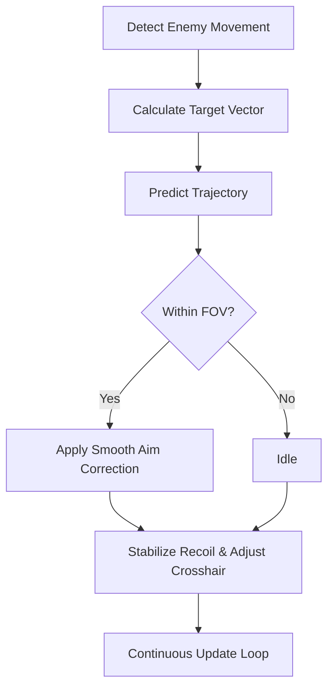

# 🎯 PUBG Aim Assist Overview

The **PUBG Aim Assist Tool** is a next-generation targeting system designed for competitive players who demand *flawless accuracy and smooth response control*. With dynamic prediction, real-time tracking, and fine-tuned customization, this software helps you achieve pinpoint aim stability across all combat ranges.

Whether you’re in close-quarters fights or long-range duels, the tool adapts to your weapon handling and crosshair movement, ensuring that every shot lands exactly where you intend.

---

## ⚙️ Core Features

**🎯 Targeting Intelligence**

* *Auto Aim Correction* – Smoothly adjust crosshair drift for precise targeting.
* *Dynamic FOV Tracking* – Detect and prioritize enemies within a customizable radius (default 25°).
* *Recoil Suppression* – Automatically stabilize scope aim and spray patterns.
* *Predictive Bullet Pathing* – Adjusts aim for moving targets in real time.

**🧠 Smart Assist Modes**

* *Soft Assist Mode* – Subtle correction for a natural, controller-like feel.
* *Full Assist Mode* – Aggressive lock for maximum precision.
* *Sniper Mode* – Long-range bullet drop compensation and sway removal.

**⚡ Performance Features**

* *Low-Latency Hook* – Processes aim data at sub-millisecond refresh.
* *Weapon Sync* – Automatically detects your current gun and applies pre-set recoil tables.
* *Configurable Hotkeys* – Toggle assists, ADS modifiers, or quick-scope automation.

---

## 🧩 Compatibility Table

| Platform         | Supported  | Notes                          |
| ---------------- | ---------- | ------------------------------ |
| Windows 10/11    | ✅          | Full overlay & driver support  |
| Steam PUBG       | ✅          | Stable with DX11 mode          |
| Tencent PUBG PC  | ⚙️ Partial | Requires custom path injection |
| Controller Input | ✅          | Works with Xbox/DS4 adapters   |

> [!NOTE]
> The Aim Assist Tool is for **offline training, private lobbies, and aim refinement** purposes. Use responsibly.

---

## ⚡ Quick Setup Guide

1. **Download** `PUBG_AimAssist.zip` and extract to your game directory.
2. **Run** `AimAssist_Loader.exe` as Administrator.
3. Launch **PUBG**, then wait for the console message: *“Linked to Process”*.
4. Press `F8` to open the in-game overlay.
5. Customize your FOV, sensitivity, and assist strength.

Example config snippet:

```ini
[AimAssist]
Enable=True
AssistStrength=0.75
FOV=25
RecoilControl=True
Prediction=True

[Hotkeys]
ToggleAssist=F8
QuickScope=F7
SmoothnessAdjust=F6
```

---

## 🧠 Aim Logic Flow



---

## 💻 Performance & Optimization

| Feature        | CPU Load | GPU Load | Notes                        |
| -------------- | -------- | -------- | ---------------------------- |
| Auto Aim       | <1%      | None     | Lightweight process          |
| Prediction     | 2%       | Low      | Real-time vector math        |
| Recoil Control | 3%       | Moderate | Adaptive sync with weapon ID |
| Overlay        | 1%       | Minimal  | DX11-safe rendering          |

> [!IMPORTANT]
> Close conflicting overlays like Steam FPS or GeForce ShadowPlay before running Aim Assist for maximum precision.

---

## 🧩 Advanced Customization

**Custom Sensitivity Curves**
Fine-tune aim behavior per weapon class:

```ini
[Weapons]
AR_Sensitivity=0.65
SMG_Sensitivity=0.55
Sniper_Sensitivity=0.85
```

**Assist Mode Example:**

```ini
[Modes]
SoftAssist=True
SniperMode=False
AimSmoothness=0.9
```

**Crosshair Debug Overlay**
Displays aim drift and correction strength — ideal for practice and training.

> [!TIP]
> Combine *Predictive Pathing* with *Soft Assist Mode* to improve natural aim accuracy over time.

---

## ❓ FAQ

### 🧠 1. Is PUBG Aim Assist safe?

Yes — it modifies memory in runtime only and does not alter core files. Built for training and analysis environments.

### 🔁 2. Does it work on all maps?

Yes, the tracking algorithm is resolution-agnostic and functions across all environments.

### 🎮 3. Can I use it with a controller?

Yes — the tool automatically detects analog input for smooth adjustment curves.

### 💾 4. Where are my configs stored?

Under `Documents\PUBGAimAssist\Profiles\`, allowing quick import/export.

### ⚙️ 5. Can I adjust aim smoothness mid-game?

Yes — scroll or tap `F6` while ADS to modify smoothness on the fly.

---

## 🎯 Precision Tuning

| Parameter       | Range   | Description                              |
| --------------- | ------- | ---------------------------------------- |
| FOV             | 5°–40°  | Adjust detection cone                    |
| Smoothness      | 0.1–1.0 | Lower = faster lock, higher = human-like |
| Assist Strength | 0.3–1.0 | Defines target correction ratio          |
| Recoil Sync     | On/Off  | Toggles pattern control                  |

> [!WARNING]
> High Assist Strength (>0.9) can make aim movements appear robotic; use lower values for realism.

---

## 🏁 Final Thoughts

The **PUBG Aim Assist Tool** is the definitive performance enhancer for mastering precision and consistency.
Perfect for training sessions, replay analysis, or custom matches, it gives you *developer-grade control* over aim handling and weapon behavior — without lag or instability.

If you’re chasing cleaner headshots and faster reaction time, this is your ultimate tool for technical refinement and combat mastery.

---

**PUBG Aim Assist Tool** — sharpen your accuracy, react faster, and redefine what perfect aim feels like.
